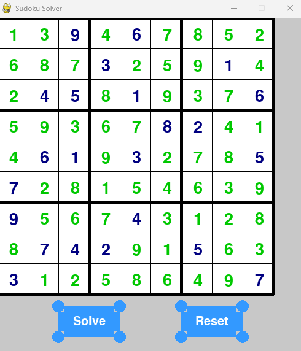

<h1>Sudoku Solver</h1>

Welcome to the Sudoku Solver repository! This project aims to develop a Sudoku solving tool using two methods: <strong>Brute Force</strong> and <strong>Backtracking</strong>.

<h2>Features</h2>

<ul>
  <li>Solve Sudoku puzzles.</li>
  <li>Two solving methods available: Brute Force and Backtracking.</li>
  <li>Display the result in the terminal.</li>
  <li>Visualize the result with Pygame.</li>
</ul>

<h2>Solving Algorithms</h2>

<h3>Brute Force Method</h3>

The Brute Force method involves checking all possible combinations of numbers from 1 to 9 until a valid Sudoku solution is found. It fills each empty cell with a number and checks if the Sudoku grid satisfies the rules. If a combination fails, it tries the next one until a valid solution is found. This method guarantees a solution, but it can be slow for complex Sudoku grids.

<h3>Backtracking Method</h3>

The Backtracking method works by choosing an empty cell and trying all possible numbers from 1 to 9. If a number conflicts with the Sudoku rules (repetition of the same number in the same row, column, or box), the algorithm backtracks to the previous filled cell and tries the next number. This process is repeated until the Sudoku is solved. Backtracking quickly eliminates incorrect solutions and optimizes the search for the final solution.

<h2>Comparison of Solving Methods</h2>

<table>
  <thead>
    <tr>
      <th>Method</th>
      <th>Algorithmic Complexity</th>
      <th>Execution Time</th>
    </tr>
  </thead>
  <tbody>
    <tr>
      <td>Brute Force</td>
      <td>Exponential</td>
      <td>Variable, depending on the grid</td>
    </tr>
    <tr>
      <td>Backtracking</td>
      <td>Exponential (better than Brute Force)</td>
      <td>Variable, depending on the grid</td>
    </tr>
  </tbody>
</table>

The comparative analysis of solving methods shows that Backtracking is more efficient than Brute Force in terms of algorithmic complexity and execution time. Backtracking significantly reduces the number of combinations to test, making it a faster method for solving Sudoku grids.

<h2>Usage</h2>

To use the Sudoku Solver, follow these steps:

<ol>
  <li>Clone this repository to your local machine.</li>
  <li>Run the application using Python and the appropriate file for the chosen solving method.</li>
  <li>Follow the instructions in the terminal to provide the name of the file containing the Sudoku grid to solve.</li>
  <li>The result will be displayed in the terminal and also visualized with Pygame.</li>
</ol>

<h2>Sudoku Examples</h2>

In the repository, you will find five Sudoku examples of varying difficulty. You can use these examples to test the Sudoku Solver.

<h2>Contributions</h2>

Contributions to the Sudoku Solver are welcome! If you have any suggestions, bug fixes, or new features to propose, feel free to open an issue or submit a pull request.

<h2>License</h2>

This project is licensed under the MIT License.

<h2>Acknowledgements</h2>

This project was developedas part of the La Plateforme programming challenge. If you have any questions or need further assistance, please don't hesitate to reach out. Happy Sudoku solving!

